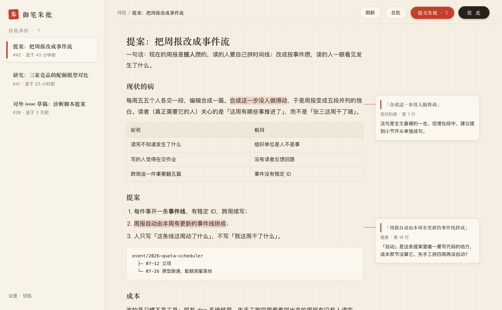
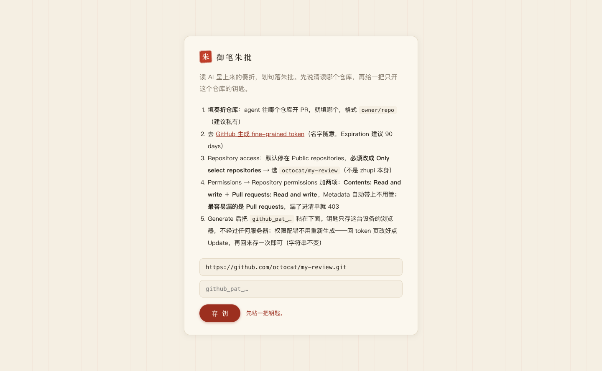
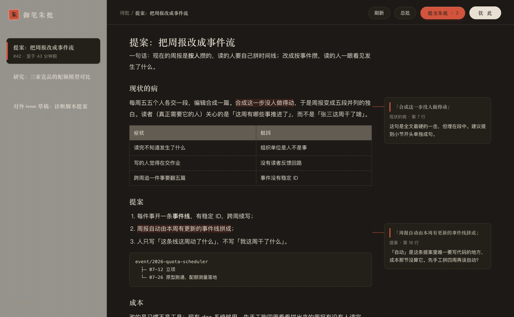

<div align="center">

[English](README.md) · **中文**

# 御笔朱批 · zhupi

**AI 产出的阅读批注台。**<br>
agent 把长文档当「奏折」以 PR 呈上来，你在**渲染态**正文上划句落「朱批」，批完一键呈回，agent 逐条回话改出下一版；**钦此** = merge = 定稿。

[**在线试用**](https://charliezong18.github.io/zhupi) · [Spec](SPEC.zh-CN.md) · [Backlog](BACKLOG.zh-CN.md)

</div>



*真实截图，内容为演示数据。*

---

## 为什么

读 agent 写的三千字，不是聊天问题。你要从头读到尾、标出错的八处、一次性交回去、下一版逐条看怎么处理的——GitHub 的 PR review 正是这个形状，只是 markdown PR 给你的是带 `+` / `-` 前缀的源码：表格没法看，批注入口藏在悬停才出现的行号旁。

朱批是同一个 PR 的一片镜片：批注还是那些批注，线程还是那些线程，merge 还是那个 merge，只是把文档当文档渲染。

| PAIN | 朱批的解法 |
|---|---|
| markdown diff 不渲染 | 只展示渲染态正文 |
| 批注入口不自发现 | 划选即批，唯一主交互 |
| approve 被作者身份堵死 | 自带「钦此」= squash merge |
| 外链掉登录态 404 | 自带渲染，不跳外链 |

## 原理

无后端、无构建、无依赖链。浏览器用你自己的 fine-grained token 直连 `api.github.com`，钥匙不离开这台设备。文档、版本、批注循环全留在 GitHub，这个 app 只是一片随时可以摘掉的镜片。

```
你的 agent ──开 PR──▶  review 仓库（私有）  ◀──朱批──  你
                              │
                              └── merge = 定稿 = 交付
```

## 上手

**1. 准备一个奏折仓库**

任何一个 agent 能往里开 PR 的仓库。建议私有——这个 app 什么都不往外发，但你的草稿大概也不该公开。

```
your-review-repo/
└── docs/
    └── <slug>.md      ← 一篇奏折 = 一个分支 + 一个 PR
```

**2. 开 app，给一把钥匙**

打开 [charliezong18.github.io/zhupi](https://charliezong18.github.io/zhupi)（或你自己 fork 的 Pages 地址）。填 `owner/repo`，然后去生成一把 [fine-grained PAT](https://github.com/settings/personal-access-tokens/new)，只授权**那一个仓库**，权限正好两项：

- **Contents: Read and write**
- **Pull requests: Read and write** ← 最容易漏的一项，漏了进清单就 403



钥匙只存这个浏览器的 localStorage，不经过任何服务器。设备丢了？去 GitHub 一键 revoke，爆炸半径 = 一个仓库。

**3. 读、批、钦此**

| 动作 | 底层是什么 |
|---|---|
| 划一句 → **朱批** | 锚在那一行的 inline review comment |
| **总批** | 整折的 conversation comment |
| **提交朱批 · n** | 把攒的批注一次性 submit 成一次 review |
| **钦此** | squash merge，定稿 |

攒着的批注存在本地，刷新丢不了。

想先看它动起来再配 token？`?demo=1&auto=1` 是免 token 冒烟：用真实浏览器事件在演示文档上自动划批。

<details>
<summary>暗色跟随系统</summary>



</details>

## 自己开一台

零写死：没有仓库名、没有 owner、没有埋点。fork 三步：

1. **Fork 本仓库**，然后 Settings → Pages → Source: *Deploy from a branch* → `main` / root。一分钟内你的 app 就在 `https://<你>.github.io/zhupi` 上线了。没有构建步骤。
2. **建你自己的 review 仓库**（私有），里面开一个 `docs/` 目录。
3. **打开你的 Pages 地址**，填 `owner/repo` + 钥匙。完事。

本地开发：`python3 -m http.server 4173`，然后开 http://127.0.0.1:4173 。整条工具链就这一行。

## SOP：agent 那一侧的规矩

朱批刻意不知道 AI 的存在——它只读 PR，谁开的不管。下面这套惯例是让循环转起来的另一半，可以整段丢给你的 agent（原样贴进 CLAUDE.md / AGENTS.md / skill 文件即可）。

**呈递一篇**

```bash
git checkout main && git pull -q
git checkout -b <slug>
# 写 docs/<slug>.md —— 只放交付物正文。元数据一律进 PR body。
git add docs/<slug>.md && git commit -m "<slug>" && git push -u origin <slug>
gh pr create --title "<类型>：<标题>" --body "<按下面的模板>"
```

两条真正要紧的规矩：

- **正文文件只放交付物本身**——不写进度、不写「我干了啥」。最后原样发出去的是什么，文件里就是什么。其余全进 PR body。
- **别用 `--draft`。** draft PR 不能 merge，而 REST API 转不了正（要走 GraphQL）。私有单人仓里 draft 换不来任何东西，却废掉「钦此」按钮。

PR body 五段模板：

```markdown
**目的地** —— merge 后交付到哪
**TLDR** —— 三行，改了什么、为什么
**待你拍板** —— 编号列出，批注里好说「答 2」
**已知弱点** —— 你希望 reviewer 使劲捅的地方
**怎么用** —— 「批完在朱批里点提交朱批，然后跟我说一声」
```

**收批注**

```bash
gh api repos/<owner>/<repo>/pulls/<n>/comments   # inline：id / path / line / body / in_reply_to_id
gh pr view <n> --comments                        # 会话区留言（总批）
```

没有你回复的 inline 批注 = 未处理。改完正文推上去，然后**每条批注必回**一句处理方式——采纳／部分采纳＋理由／不改＋理由。下一轮人读的就是这串回话；省掉它，review 循环就死了。

```bash
gh api -X POST repos/<owner>/<repo>/pulls/<n>/comments/<id>/replies -f body="..."
```

**钦此**

人在 app 里按「钦此」（或你跑 `gh pr merge <n> --squash --delete-branch`）。merge = 定稿 = 按 PR body 声明的目的地交付。

## 已知边界

老实列一遍，让你知道自己 fork 的是什么：

- **只支持 markdown 文档。** 代码 PR 会显示「此折无 markdown 正文」。并排／左右分栏的 diff 评审是北极星，尚未交付——见 [SPEC §10](SPEC.zh-CN.md)。
- **锚定是宽松的，这是设计选择。** 批注钉在渲染块对应的源码行上；批注正文里永远带着你划的原句，所以哪怕行号钉歪，语义也不会丢。理由见 [SPEC §9](SPEC.zh-CN.md)。
- **GitHub 只允许在 PR diff 里出现过的行上批注。** 新增文件整份都在 diff 里，所以奏折永远能批；改动已有文件则只有部分行可钉。提交前 app 会本地校验——因为 GitHub 的 review 提交是原子的，一个非法行号会让整批朱批全灭。
- **桌面优先。** 移动端 + PWA 排在 v1（[设计稿已画好](SPEC.zh-CN.md)）。
- **没有通知、没有未读、没有 feed。** 故意的（[SPEC §3](SPEC.zh-CN.md) 非目标）。

## 结构

```
index.html        入口（一个 root div，其余全由 ui.js 渲染）
src/ui.js         Preact 视图层 —— 单向数据流；markdown 正文是非受控 DOM 岛，
                  这样基于 Range 的高亮能在重渲染中存活
src/anchor.js     纯逻辑：选区 → 行锚、hunk 解析、草稿持久化
src/github.js     GitHub API 封装
src/render.js     markdown → HTML（块级元素带 data-line 供锚定）
src/style.css     宣纸 / 墨 / 朱砂
test/             单元 + DOM + 端到端，零依赖
vendor/           markdown-it + htm/preact standalone（13KB），vendored —— 无 npm、无 lockfile
```

全部应用代码约 900 行。依旧**零构建**（push 即部署），但不再是无框架：[量化闸门](MIGRATION-WATCH.zh-CN.md)于 2026-07-26 双指标触发（两条均被评审证实是事件／异步时序类 bug 的高发层），视图层按规矩迁到了免构建形态的 Preact。闸门用数字说话，我们照办。

## License

[MIT](LICENSE) © Charlie Zong

## 测试

```bash
test/run.sh            # 全跑：34 单元 + 22 DOM + 13 端到端
test/run.sh unit       # 只跑纯逻辑（Node 内置 runner，不用 npm install）
test/run.sh browser    # DOM 单元 + 免 token 端到端冒烟，跑在真 Chrome 里
```

没有测试框架、没有 `npm install`、没有配置文件。单元层用 `node --test`；DOM 与端到端层跑在
headless Chrome 里，失败非零退出。**闸门是 pre-push hook，CI 只是第二意见。** 这个仓没有 branch protection，push 直进 main 且
Pages 与测试**并行**跑——光靠 CI，坏提交永远是先上线后报警。所以真闸门在 push 之前：

```bash
git config core.hooksPath .githooks   # 每个 clone 做一次
```

`.githooks/pre-push` 在这次 push 动了代码时跑全量、只动文档时只跑单元层（改个错别字不该花 90 秒），
红了直接拒推并打出是哪条断言挂的。`git push --no-verify` 是逃生门。

真正覆盖的是：hunk 校验器（错一个行号整批 review 422 全灭）、锚定行号数学（fence +1 /
缩进块 +0 / 表格逐行）、批注串线、API 请求装配（commit_id、merge sha、401 与 403 分流），
以及一条用真实浏览器事件在演示文档上划批、并检查旧版只读态的端到端。
