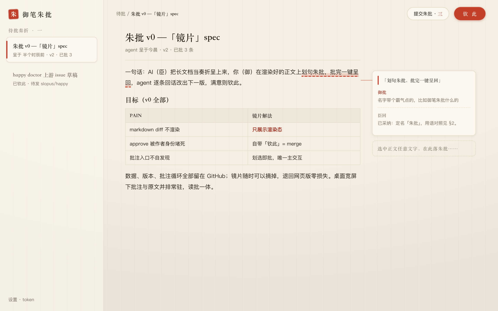
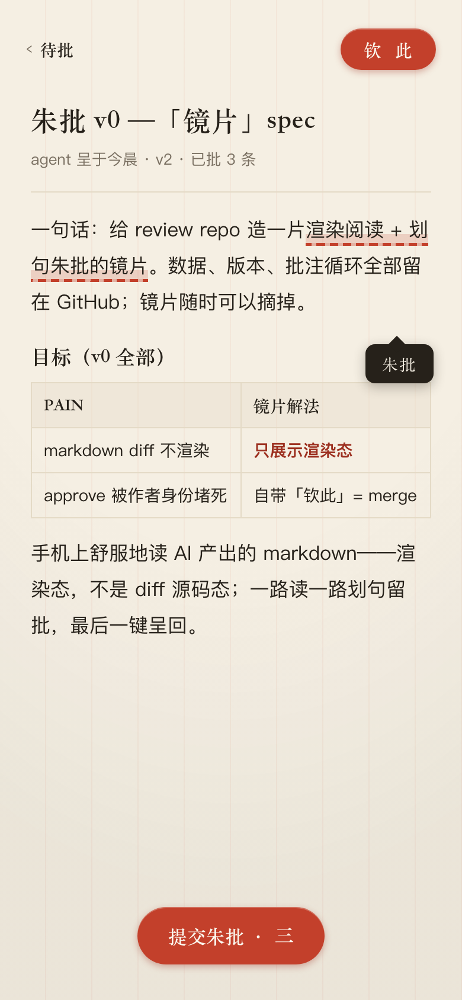
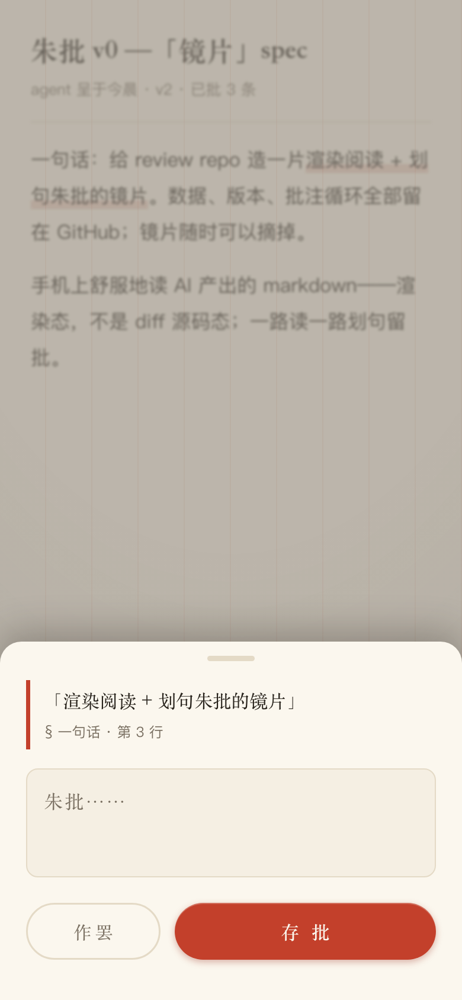
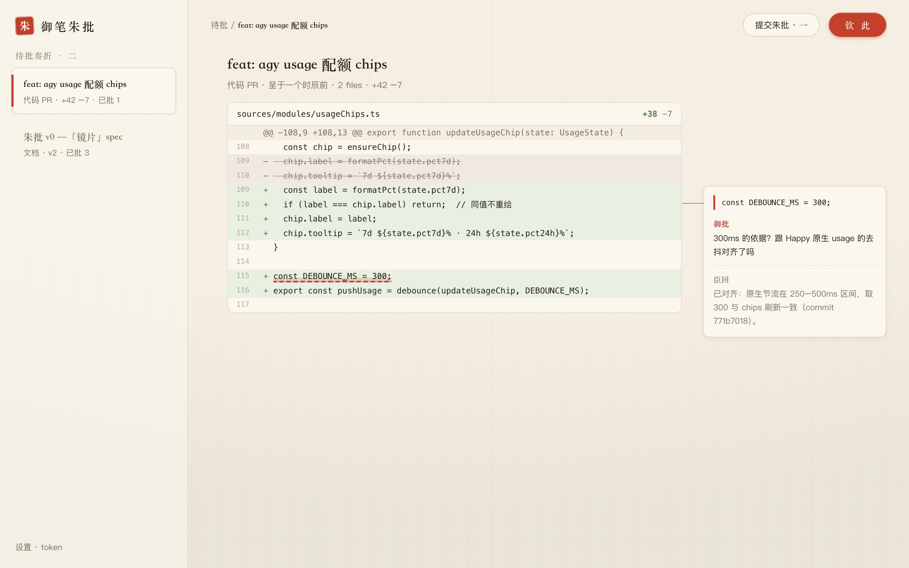
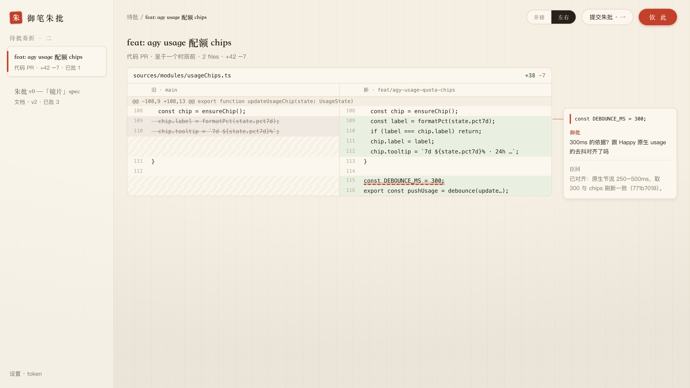

# 朱批 v0 spec —「御笔朱批」阅读批注器

一句话：AI（臣）把长文档当**奏折**呈上来，你（御）在渲染好的正文上**划句朱批**，批完一键呈回，agent 逐条回话改出下一版，满意则**钦此**（merge 定稿）。数据、版本、批注循环全部留在 GitHub，这个 app 只是一片可以随时摘掉的镜片。

依批修订（v2）：新增设计渲染图（§1）、名字改「朱批」（§2）、v1→v2 对比视图讲人话（§7）、技术栈对比表（§8）、锚定通俗版（§9）、名词表（§12）、参考（§13）。v2.2（7/26 口头输入）：改为**桌面网页优先**，移动端挪 v1（§1 / §4 / §6 / §10）。v2.3–2.4：diff 奏折概念图 + 左右分栏视图（§10 / §1）。

**v2.5（2026-07-26）：三问全部拍板 —— ②不做对比视图 ③技术栈 A（零构建）④接受宽松锚定；新增 §8.1 架构切换 breakpoint 量化闸门。spec 定稿，开工 M1。**

## 目录

- §1 设计渲染图
- §2 名字与用语
- §3 目标 / 非目标
- §4 形态
- §5 数据与认证
- §6 页面与交互
- §7 待拍板 ②：v1→v2 对比视图（讲人话）
- §8 待拍板 ③：技术栈对比
- §9 待拍板 ④：批注锚定（讲人话）
- §10 里程碑
- §11 风险与兜底
- §12 名词表
- §13 参考

## §1 设计渲染图

设计语言：宣纸底 + 墨字 + 朱砂红只留给「批」的动作；背景有极淡的朱丝栏（奏折纸的竖界栏）纹理；标题与按钮用宋体（御的声音），正文用苹方（现代阅读）。

**① 桌面主界面（v0 主战场）** —— 左奏折列表、中渲染正文、右缘朱批栏：批注与原文并排常驻（Docs 式 margin comments），批注卡里能看到「御批 → 臣回」的循环；右上「钦此」：

以下三张为移动端设计（v1 再做，先留底稿）：

**② 清单页「待批奏折」** —— 每折一张卡，左侧朱砂书脊 = 等你批；方印章标状态：

**③ 阅读页** —— 渲染态正文，划过的句子带朱砂笔道，底部常驻「提交朱批·n」：

**④ 批注输入（移动端）** —— 划选后底部弹批注单：引文（带出处行号）+ 输入框 + 存批/作罢：

（mockup 源码在 `assets/mockups/src/`，正式开发以此为准微调。）

## §2 名字与用语

按你的方向定名 **朱批**（产品全称「御笔朱批」）：repo `zhupi`，站点 `charliezong18.github.io/zhupi`，PWA 主屏名「朱批」。备选想过 批红（明制司礼监代批，有太监代笔梗，弃）、奏对、御览——「朱批」最准：动作就是你干的这件事。

界面用语与技术底层的对照（全 app 词汇一致，学一次就会）：

| 界面词 | 底层动作 |
|---|---|
| 奏折 | review repo 里一个 open PR 的文档 |
| 朱批 | inline review comment（锚在原文某句上） |
| 总批 | conversation comment（整折的总评，比如你的序号式回答） |
| 提交朱批 | 把攒的批注一次性 submit review |
| 钦此 | squash merge，定稿 |
| 作罢 | 丢弃这条未写完的批注 |

「总批」是 v2 新提的一等公民：两轮实测你都自发用了「序号列意见」的总评式批注，这个习惯直接进产品，不只当兜底。

## §3 目标 / 非目标

目标（v0 全部）：

- 手机上舒服地读 AI 产出的 markdown——渲染态，不是 diff 源码态
- 一路读一路划句朱批 + 随时写总批，最后一键呈回
- 一个真正能按的「钦此」
- 逐条消掉已知 PAIN：

| PAIN（试点实录） | 朱批解法 |
|---|---|
| approve 被作者身份堵死 | 自带「钦此」= merge |
| 批注入口不自发现 | 划选即批，唯一主交互 |
| markdown diff 不渲染 | 只展示渲染态 |
| 外链掉登录态 404 | 自带渲染 + PWA，不跳任何外链 |

非目标（v0 冻结，提了也不做）：feed 排序 / 未读管理 / 通知推送（被否掉的 attention inbox）；多 repo 浏览与代码 diff（v0 不做，但已列为 v1 北极星，见 §10）；AI 集成（agent 侧由 review-loop skill 全权负责，朱批不知道 AI 存在）；编辑文档（只读 + 批）。

## §4 形态

- 纯静态单页应用，GitHub Pages 托管：新公开 repo `zhupi`
- 代码公开、内容私有：页面不含任何数据与密钥，文档由浏览器用你的 token 现拉
- **桌面网页优先**（v0）：宽屏两栏布局（奏折列表 + 阅读区）+ 右缘朱批栏；⌘Enter 呈回等快捷键
- 移动端 + PWA 挪到 v1（手机设计已备，见 §1 图②③④）

## §5 数据与认证

- 唯一数据源：`charliezong18/review`（私有），浏览器直连 `api.github.com`（官方开 CORS）
- 认证讲人话：GitHub 后台生成一个**只对 review 这一个仓库有效**的钥匙（fine-grained PAT，权限只勾 Contents 和 Pull requests 两项），第一次打开 app 粘贴一次，存在手机浏览器本地（localStorage）。钥匙不经过任何服务器、不发给任何人；手机丢了去 GitHub 一键作废即可
- 无后端、无第三方请求、无统计埋点

## §6 页面与交互

**清单页**：open PR 列表（标题 / 呈递时间 / 已批数 / 状态印章）；手动下拉刷新（无后端无推送，v0 接受）。

**阅读页**：拉 PR head 分支的 `docs/*.md`，markdown-it 渲染（表格、代码块、任务列表全支持）；阅读排版=正文 17px、行宽上限、1.8 行高、暗色跟随系统；顶部「钦此」、底部「提交朱批·n」。

**批注**：划选文字 → 右缘朱批栏落卡（§1 图①，与原文并排；移动端 v1 用底部批注单，图④）；批注先攒本地草稿（localStorage 防写一半丢），已批句子淡朱高亮；「提交朱批」一次性写回该 PR 的 inline comments；总批入口常驻顶栏。

**循环闭环**：阅读页展示已有批注串 + agent 的逐条回话（v2 回来对着看每条怎么处理的）；「钦此」弹一次确认后 squash merge，折子从清单消失。

## §7 待拍板 ②：v1→v2 对比视图（讲人话）

场景：你在 v1 上批了 10 条，我改出 v2 呈回。你重读 v2 时，有两种姿势——

- **A. 不做对比视图（v0 打算这样）**：你直接重读渲染版；每条朱批下面有我的回话（「已改，第 3 节重写」），你按批注串定位到改动点。成本=你要重读或按回话跳读。
- **B. 做对比视图**：v2 里相对 v1 变过的段落自动高亮（类似 Word 修订模式）。爽，但要在渲染态上做段落级 diff 算法 + UI，是 v0 里最贵的一块。

拍板问题就是：**A 够不够你用？** 我的推荐：v0 用 A，真觉得缺再在 v0.5 上 B——那时有真实使用数据，知道你重读时到底怎么找改动。

**✅ 已拍板（2026-07-26）：v0 用 A（不做对比视图）**，B 留待真实使用后按需追加。

## §8 待拍板 ③：技术栈对比

| | A. 零构建：vanilla JS + markdown-it（推荐） | B. Preact + Vite | C. React + Next |
|---|---|---|---|
| 是什么 | 不用框架，手写几个 JS 文件，渲染库直接打包进 repo | 迷你版 React（3KB）+ 现代打包器 | 全家桶 |
| 开发速度 | 中（交互手写，但 v0 状态很少） | 快（组件化顺手） | 快但杀鸡牛刀 |
| 维护成本 | **最低：零依赖链，两年后打开还能跑** | 中：依赖要跟版本 | 高 |
| 部署 | push 即上线（Pages 直接托管源文件） | 要 build 步骤（Actions 里跑） | 要 build + 体积大 |
| 适配本项目 | v0 三个页面、状态极少，正合适 | v1 若长出复杂交互再迁不迟 | 否决 |

推荐 A 的核心理由：这是个**你私人用十年**的小工具，不是要招人协作的工程——依赖越少，越不会有「两年后 npm install 装不动」的坟场问题。代价：交互代码写起来比组件化啰嗦一点，多花的是我的时间不是你的。

**✅ 已拍板（2026-07-26）：A。B/C 保留为未来选项，按下面的 breakpoint 触发。**

### §8.1 架构切换 breakpoint（量化闸门）

零构建方案的失效有明确征兆。触发**任意两条**即认定 A 已到顶，暂停功能开发，先做 A→B（Preact + Vite）迁移；只触发一条则记录观察，不动架构。每次开发结束顺手对照一遍，超标的写进 `MIGRATION-WATCH.md`。

| # | 指标 | 阈值（触发线） | 为什么是这个数 |
|---|---|---|---|
| 1 | 单个 JS 文件行数 | 任一文件 > 800 行 | 超过这个量，手写 DOM 更新的分支就压不住了 |
| 2 | 应用总代码量 | > 2500 行（不含 vendored 库） | 三个页面写到这个体量，说明状态复杂度已越界 |
| 3 | 手写 DOM 更新点 | 单页 > 25 处 `innerHTML` / `appendChild` / 属性同步 | 这是「该上响应式框架」最直接的信号 |
| 4 | 状态源数量 | 需要跨页面同步的独立状态 > 6 个 | 手写订阅开始比框架更费脑子 |
| 5 | 同类渲染 bug 复发 | 同一类「界面没跟上数据」bug 修 ≥ 3 次 | 症状级信号，比代码量更硬 |
| 6 | 单次改动波及面 | 加一个小功能要改 ≥ 4 个文件 | 说明缺少组件边界 |
| 7 | 首屏加载 | > 1.5s（本地网络，冷缓存） | 无构建=无 tree-shaking/压缩，体积到顶的信号 |

**触发后的迁移成本预估**：锚定算法、GitHub API 封装、样式全部可原样搬（这三块占代码量大头），只有视图层重写，估半天到一天。所以 A 不是死路，是一条可控退路的起点。

**C（React + Next）的触发线单列**：只有当朱批需要**服务端**（推送通知、多人协作、非 GitHub 数据源）时才考虑——那时是产品形态变了，不是架构撑不住了。v0/v1 内不评估。

## §9 待拍板 ④：批注锚定（讲人话）

先答一个 §8 的延伸问题：**A（零构建）做得了划句批注吗？** 做得了——划句批注的全部能力（选中文字、拿到选区位置、注入高亮、右缘卡片定位）来自浏览器**原生**的 Selection API 和 DOM 操作，框架并不提供这层能力；标杆产品 Hypothesis 的批注层本身就是原生 DOM 注入实现的。框架帮的忙是「复杂状态下的界面自动刷新」，而朱批的状态只有一个草稿列表。真正难的是下面的锚定算法——那段代码在 A/B 两个方案里一字不差。

「锚定」= 你在渲染页上划了一句话，系统要算出它对应源 markdown 文件的**第几行**，才能写成 GitHub 的 inline comment（GitHub 的批注钉在行号上）。

流程举例：你划了「镜片随时可以摘掉」→ 系统拿这句原文去源文件里搜 → 唯一匹配在第 3 行 → 批注钉在第 3 行。

两种失败场景和兜底：

1. 这句话在文中出现两次 → 钉到离你阅读位置最近的那处；
2. 完全定位不到（比如跨了好几个元素划选）→ 钉到该段落最近的标题行。

**不管钉得准不准，批注正文里都自动带上「> 你划的原句」**——哪怕行号钉歪，你和 agent 看批注都知道批的是哪句，语义永远不丢。这就是「宽松锚定 + 引文兜底」。拍板问题：**接受这个精度吗？**（像素级精准要重得多，v0 不值。）

**✅ 已拍板（2026-07-26）：接受。**

## §10 里程碑（每步交付试玩链接）

1. **M1 骨架**：token 设置页 + 桌面两栏布局（奏折列表 + 阅读区）+ 渲染阅读——先把「读」做舒服
2. **M2 朱批**：划选 → 右缘批注栏攒批 → 一键呈回（含总批）
3. **M3 闭环**：批注串与回话展示、钦此

**v1：移动端 + PWA**（2026-07-26 输入：review 主战场在电脑，桌面先行；§1 图②③④的手机设计留作底稿）。

**北极星（v1 之后再排）：diff 奏折**——真代码 PR 也进同一个清单，同一套朱批/总批/钦此语义。这是「design 跟 diff 统一入口、统一格式」的完全体（2026-07-26 口头总批补充的主诉求）；先把 markdown 文档这半做扎实。概念图（同一个右缘朱批栏落在代码行上；配色规矩：**朱砂只属于御批**，增行用茶青、删行用墨划，不与批注抢红）：

**左右分栏（split view）为桌面默认**，顶栏「并排 / 左右」一键切（2026-07-26 输入：Charlie 读 diff 偏好左右对照）。左旧右新，删行墨划、增行茶青，占位段用斜纹表示"这边没有对应行"；朱批仍落在**新版那一侧**的行上（GitHub 的 inline comment 只认新文件行号），右缘朱批栏不变：

窄屏（<1280px）自动退回并排视图——左右分栏挤两栏代码 + 批注栏会把代码压到没法读；这是 v1 移动端天然只有并排视图的原因。

## §11 风险与兜底

- 锚定精度是最大技术风险 → §9 的宽松锚定 + 引文兜底
- PAT 在 localStorage → 手机丢失去 GitHub 一键 revoke，爆炸半径 = 一个私有 repo
- API 配额：认证后 5000 次/时，个人阅读量级毫无压力
- 朱批本身挂了 → 退回 GitHub 网页，数据零损失

## §12 名词表

| 词 | 意思 |
|---|---|
| PAT | Personal Access Token，GitHub 的个人密钥；fine-grained = 只授权单个仓库的细粒度版本 |
| CORS | 浏览器的跨域许可机制；GitHub API 开了它，网页 JS 才能直连 |
| localStorage | 浏览器自带的本地小仓库，数据只存这台设备的这个浏览器 |
| PWA | 能「添加到主屏幕」当 app 用的网页 |
| markdown-it | 把 markdown 文本渲染成 HTML 的 JS 库，兼容 GitHub 同款语法（GFM） |
| vanilla JS | 「原生 JS」，不用任何框架 |
| Preact / Vite | 迷你版 React / 现代前端打包器 |
| squash merge | 把一个 PR 的所有提交压成一个并入 main |
| inline comment | GitHub 里钉在具体某一行上的批注 |
| 锚定 | 把你划的句子换算成源文件行号的过程（§9） |

## §13 参考

- GitHub REST API：[PR 批注](https://docs.github.com/en/rest/pulls/comments) / [PR review](https://docs.github.com/en/rest/pulls/reviews)
- [GitHub Pages 文档](https://docs.github.com/en/pages)
- [markdown-it](https://github.com/markdown-it/markdown-it)（渲染库）
- [Hypothesis: Fuzzy Anchoring](https://web.hypothes.is/blog/fuzzy-anchoring/)——网页批注锚定的经典先例，§9 思路来源
- [W3C Web Annotation Data Model](https://www.w3.org/TR/annotation-model/)——批注数据的标准形状，v0 只借概念不照搬
- [MDN Selection API](https://developer.mozilla.org/en-US/docs/Web/API/Selection)——「划选文字」用的浏览器原生能力
- [Preact](https://preactjs.com) / [Vite](https://vitejs.dev)（§8 的 B 方案）
